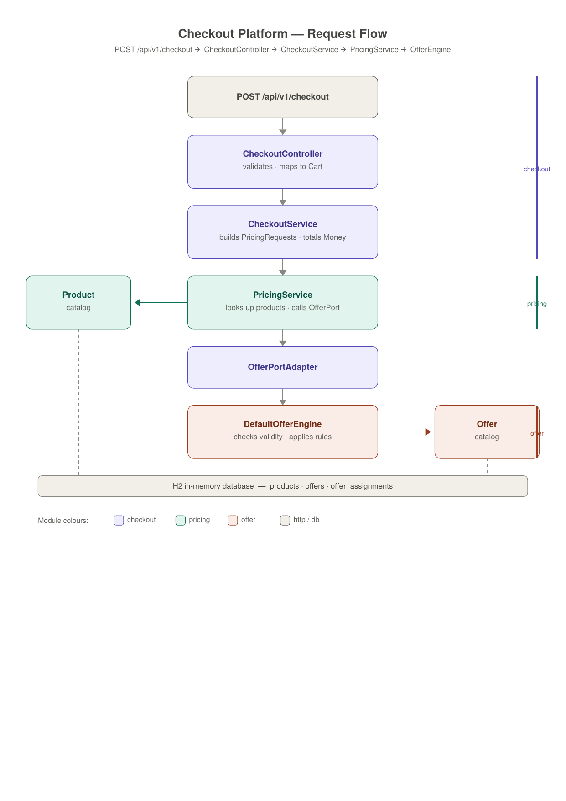
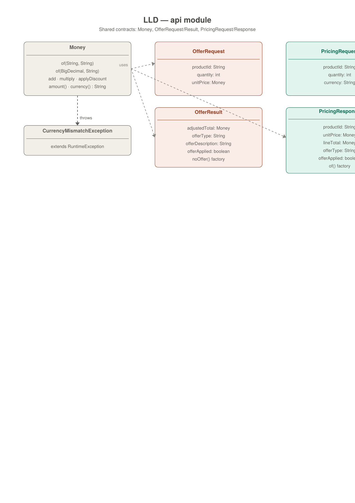
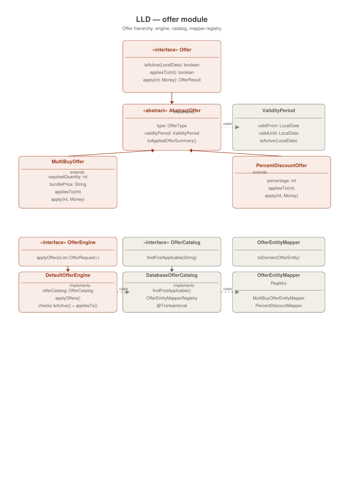
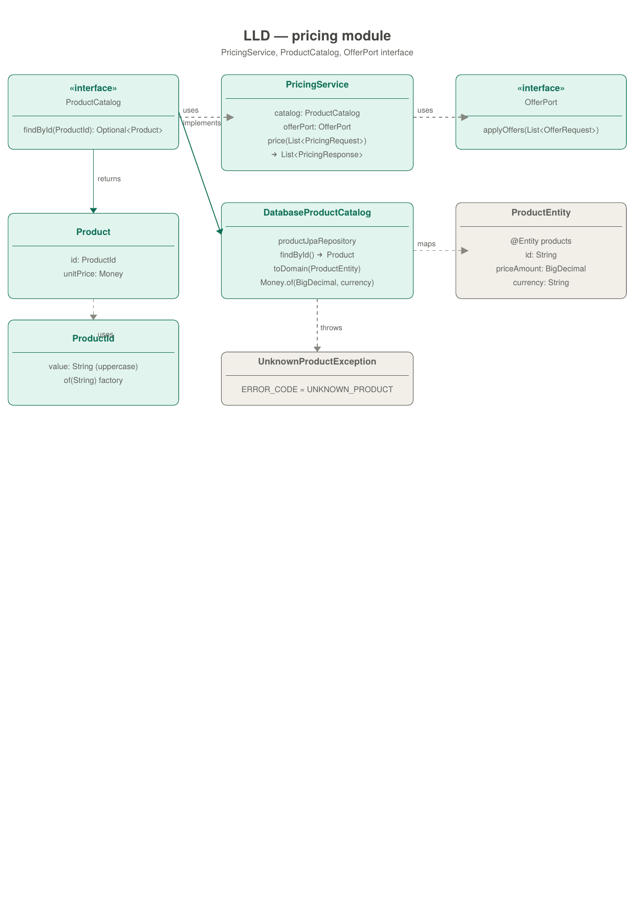
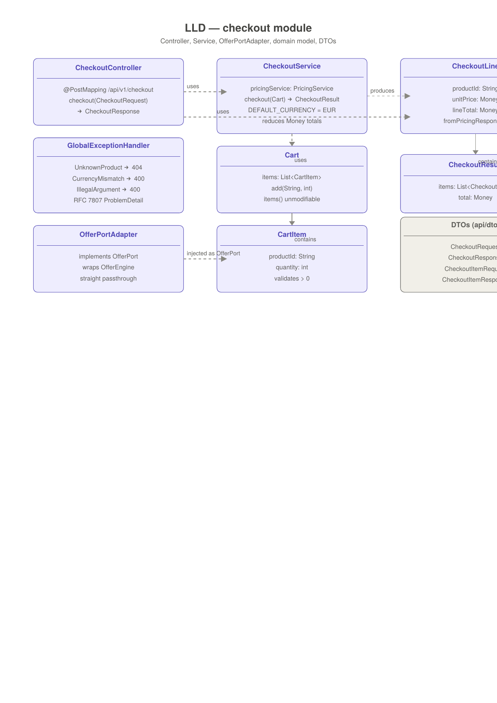

# Checkout Platform

A modular Spring Boot checkout system that handles product pricing and promotional offers. This document covers the current multi-module design, the reasoning behind each decision, and how the system is positioned to evolve into independent microservices.

---

## Table of Contents

- [Architecture Overview](#architecture-overview)
- [Module Structure](#module-structure)
- [Key Design Decisions](#key-design-decisions)
- [Evolution from v1](#evolution-from-v1)
- [Running the Application](#running-the-application)
- [API Documentation](#api-documentation)
- [Adding a New Offer Type](#adding-a-new-offer-type)
- [Known Limitations and Roadmap](#known-limitations-and-roadmap)
- [Microservices Migration Path](#microservices-migration-path)

---

## Architecture Overview

```
checkout-platform/
├── api/        # Shared contracts — OfferRequest, OfferResult, PricingRequest, PricingResponse, Money
├── offer/      # Offer domain — rules, catalog, engine
├── pricing/    # Pricing domain — product catalog, price resolution
└── checkout/   # Application entry point — REST API, orchestration
```

The dependency graph is intentionally unidirectional:

```
checkout ──▶ pricing ──▶ api
    │                     ▲
    └──▶ offer ───────────┘
```

`pricing` depends on `offer` only through the `OfferPort` interface it owns. The concrete implementation (`DefaultOfferEngine`) lives in `offer` and is wired by `checkout` via `OfferPortAdapter`. This means `pricing` has zero compile-time knowledge of `offer`.

---

## Architecture Diagrams

### Request flow


📄 Full resolution: [request-flow.pdf](docs/diagrams/request-flow.pdf)

### LLD API


📄 Full resolution: [lld-api.pdf](docs/diagrams/lld/lld-api.pdf)

### LLD OFFER


📄 Full resolution: [lld-offer.pdf](docs/diagrams/lld/lld-offer.pdf)

### LLD Pricing


📄 Full resolution: [lld-pricing.pdf](docs/diagrams/lld/lld-pricing.pdf)

### LLD Checkout


📄 Full resolution: [lld-checkout.pdf](docs/diagrams/lld/lld-checkout.pdf)

## Module Structure

### `api` — Shared Contracts
Pure data structures shared across modules. No Spring, no JPA — just records and value objects.

| Class | Purpose |
|---|---|
| `Money` | Value object encapsulating amount and currency. `BigDecimal` is invisible outside this class. |
| `CurrencyMismatchException` | Thrown when arithmetic is attempted between different currencies. |
| `OfferRequest` | Input contract for the offer engine. |
| `OfferResult` | Output contract from the offer engine. |
| `PricingRequest` | Input contract for the pricing service. |
| `PricingResponse` | Output contract from the pricing service. |

### `offer` — Offer Domain
Encapsulates all promotional offer logic. Completely self-contained — no knowledge of pricing or checkout.

| Class | Purpose |
|---|---|
| `Offer` | Interface defining the offer contract — `appliesTo()`, `apply()`, `isActive()`. |
| `AbstractOffer` | Base implementation providing validity period and summary. |
| `MultiBuyOffer` | Buy N items for a fixed bundle price. |
| `PercentDiscountOffer` | Apply a percentage discount to the line total. |
| `OfferEngine` / `DefaultOfferEngine` | Applies offers to a list of requests, respecting validity and quantity thresholds. |
| `OfferCatalog` / `DatabaseOfferCatalog` | Looks up the highest-priority active offer for a product. |
| `OfferEntityMapperRegistry` | Registry pattern — maps `OfferEntity` to the correct domain type without conditionals. |

### `pricing` — Pricing Domain
Resolves product prices and delegates offer application through a port interface.

| Class | Purpose |
|---|---|
| `PricingService` | Resolves products from the catalog, builds offer requests, assembles pricing responses. |
| `ProductCatalog` / `DatabaseProductCatalog` | Looks up products by ID, maps to `Product` with `Money` unit price. |
| `OfferPort` | Interface owned by `pricing` — the boundary between pricing and offer. Prevents compile-time coupling. |
| `Product` | Domain record holding `ProductId` and `Money unitPrice`. |
| `ProductId` | Value object — normalises product IDs to uppercase and trims whitespace. |

### `checkout` — Application Entry Point
Orchestrates the checkout flow. The only module that knows about all other modules.

| Class | Purpose |
|---|---|
| `CheckoutController` | REST endpoint — `POST /api/v1/checkout`. Validates input, delegates to `CheckoutService`. |
| `CheckoutService` | Converts cart to pricing requests, calls `PricingService`, aggregates totals using `Money`. |
| `OfferPortAdapter` | Wires `OfferEngine` (from `offer`) to `OfferPort` (from `pricing`). The only class that imports both modules. |
| `Cart` / `CartItem` | Validated, immutable cart domain model. |
| `GlobalExceptionHandler` | Produces RFC 7807 Problem Detail responses for all known exceptions. |

---

## Key Design Decisions

### 1. `Money` value object
All monetary values are encapsulated in `Money(amount, currency)`. `BigDecimal` is invisible outside `Money` and JPA entity mappers. This eliminates an entire class of bugs — currency mismatches throw `CurrencyMismatchException`, scale is always enforced at 2 decimal places with `HALF_UP` rounding, and negative amounts are rejected at construction time.

The original v1 design had a `Money` class but it hardcoded EUR in its factory methods (`Money.eur()`, `Money.zero()`) and exposed `BigDecimal amount` and `Currency currency` as public Lombok getters. The new `Money` hides these entirely — `amount()` returns a `String`, currency validation happens at construction, and there is no way to extract the raw `BigDecimal` from outside the class.

### 2. `api` module as shared contract layer
`OfferRequest`, `OfferResult`, `PricingRequest`, and `PricingResponse` live in `api` — a dependency-free module. Each module only knows what it sends and what it receives, not how the other side works internally. When these modules become microservices, the contracts become HTTP or message DTOs with no structural change needed.

### 3. `OfferPort` — dependency inversion between pricing and offer
`pricing` defines `OfferPort` as its own interface. `offer` implements it. `checkout` wires them via `OfferPortAdapter`. This means `pricing` has no compile-time dependency on `offer` — the `pricing.gradle` file has no `implementation project(':offer')`. Splitting into separate services requires only replacing `OfferPortAdapter` with an HTTP client — nothing else changes.

### 4. `OfferEntityMapperRegistry` — open/closed offer types
Adding a new offer type requires no changes to existing code. Create a new `AbstractOffer` subclass, implement `OfferEntityMapper` for it, and annotate with `@Component`. Spring injects it into the registry automatically.

### 5. Offer validity enforced at the engine level
`DefaultOfferEngine` calls `offer.isActive(LocalDate.now())` before applying any offer. The v1 design pushed validity filtering into `DatabaseOfferCatalog.findActiveOffer()` which mixed infrastructure concerns with business logic. Moving it to the engine means the rule is enforced regardless of how the catalog is implemented.

### 6. RFC 7807 Problem Details for errors
All exceptions are mapped to structured Problem Detail responses. Unknown products return 404, currency mismatches and invalid arguments return 400 — all with a consistent JSON shape. The v1 design returned a plain `Map<String, String>` with a 400 for unknown products — no differentiation between product-not-found and bad input.

---

## Evolution from v1

The original submission was a single-module Spring Boot application. It was a solid foundation — good domain modelling with `Money`, `Cart`, `ProductId`, and the mapper registry pattern. The changes in this version address the structural problems that would become blockers as the system grows.

### What was already good in v1
- `Money` value object with arithmetic operations
- `ProductId` value object with normalisation
- `Cart` with quantity accumulation — adding the same product twice merges the quantities
- `OfferEntityMapperRegistry` — extensible without touching existing code
- `ValidityPeriod` as a self-contained value object
- Integration tests covering the main checkout scenarios
- OpenAPI/Swagger documentation on the controller

### What changed and why

| Problem in v1 | Impact | Fix in v2 |
|---|---|---|
| Single module — all concerns in one place | No enforced boundary between offer logic, pricing logic, and the API layer | Split into `api`, `offer`, `pricing`, `checkout` modules with explicit Gradle dependencies |
| `PricingService` called `offerCatalog` directly — item by item | Cannot separate pricing and offer into independent services | `OfferEngine` processes all items in one batch call; `OfferPort` decouples the dependency |
| `Money` hardcoded EUR — `Money.eur()`, `Money.zero()` | Cannot support multi-currency. Currency is an assumption, not a contract | `Money.of(amount, currency)` — currency is always explicit. `CurrencyMismatchException` for mismatched arithmetic |
| `Money` exposed `BigDecimal` and `Currency` via Lombok `@Getter` | Any caller could extract raw amounts and bypass `Money`'s invariants | `amount()` returns `String`, `currency()` returns `String`. No raw `BigDecimal` access outside the class |
| No `OfferResult` contract — `Offer.priceFor()` returned `Money` directly | Offer result carried no metadata — no type, no description, no applied flag | Explicit `OfferResult` with `offerType`, `offerDescription`, `offerApplied` fields |
| `appliedOffer` in `CheckoutLine` was `null` when no offer applied | Null propagation across layers, null checks in controller | `OfferResult.noOffer()` factory — always a result, never null. `offerApplied = false` when not applied |
| `UnknownProductException` mapped to HTTP 400 | Product-not-found is not a bad request — it is a not-found | Mapped to HTTP 404 with RFC 7807 Problem Detail |
| Offer validity checked inside `DatabaseOfferCatalog` | Infrastructure layer responsible for a business rule | Moved to `DefaultOfferEngine` — business logic stays in the domain layer |

### What v1 had that v2 does not yet have
- **OpenAPI/Swagger documentation** — v1 had full `@Operation`, `@ApiResponse`, and `@Schema` annotations. On the roadmap for v2.
- **`Clock` injection** — v1 injected `Clock` into `PricingService` making date-dependent logic testable. v2 calls `LocalDate.now()` directly. Will be restored when unit tests are added.
- **`Cart` quantity accumulation** — v1 merged quantities when the same product was added twice. Removed in v2 for simplicity — candidate for reinstatement depending on requirements.

---

## Running the Application

**Prerequisites:** Java 25, Gradle

```bash
./gradlew run
```

The application starts on `http://localhost:8080` with an in-memory H2 database pre-seeded with:

| Product | Price | Offer |
|---|---|---|
| `APPLE` | €0.30 | Buy 2 for €0.45 (MULTI_BUY), valid March 2026 |
| `BANANA` | €0.20 | 10% discount (PERCENT_DISCOUNT), valid March 2026 |

---

## API Documentation

API documentation is generated from the integration tests using [Spring REST Docs](https://docs.spring.io/spring-restdocs/docs/current/reference/htmlsingle/). This means the documentation is always accurate — if a test passes, the docs reflect the real behaviour of the API.

### Viewing the docs

**Option 1 — In the browser while the app is running:**

```bash
./gradlew :checkout:asciidoctor
./gradlew run
```

Then open `http://localhost:8080` — the root URL redirects to the generated API documentation.

**Option 2 — Static HTML in the docs folder:**

```bash
./gradlew :checkout:asciidoctor
```

The rendered HTML is copied to `docs/api/index.html` at the root of the project. Open it directly in any browser.

### Regenerating the docs

The docs are regenerated every time the integration tests run:

```bash
./gradlew :checkout:asciidoctor
```

This runs the integration tests, captures request/response snippets, and renders them into HTML. The output is placed in both:
- `checkout/build/docs/asciidoc/` — Gradle build output
- `docs/api/` — project-level docs folder
- `checkout/src/main/resources/static/docs/` — served by Spring Boot at `http://localhost:8080/docs/`

### What is covered

The integration tests and generated docs cover:

| Scenario | Description |
|---|---|
| Multi-buy offer applied | 2 apples → bundle price of €0.45 |
| Percent discount applied | 3 bananas → 10% off, total €0.54 |
| Offer not applied | 1 apple → regular price, offer shown but not applied |
| Multiple items | Mixed cart with both offer types |
| Unknown product | 404 Problem Detail response |
| Empty items list | 400 validation error |
| Invalid quantity | 400 validation error |
| Blank product ID | 400 validation error |

---

## Adding a New Offer Type

The offer engine is designed to be extended without modifying existing code.

**Example: Add a `BUY_ONE_GET_ONE` offer type**

**Step 1 — Add the enum value:**
```java
public enum OfferType {
    MULTI_BUY,
    PERCENT_DISCOUNT,
    BUY_ONE_GET_ONE
}
```

**Step 2 — Implement the offer rule:**
```java
public final class BuyOneGetOneOffer extends AbstractOffer {

    @Override
    public boolean appliesTo(int quantity) {
        return quantity >= 2;
    }

    @Override
    public OfferResult apply(int quantity, Money unitPrice) {
        int paidItems = (quantity + 1) / 2;
        Money total = unitPrice.multiply(paidItems);
        return new OfferResult(total, type().name(), toAppliedOfferSummary().description(), true);
    }
}
```

**Step 3 — Implement the entity mapper:**
```java
@Component
public class BuyOneGetOneOfferEntityMapper implements OfferEntityMapper {

    @Override
    public OfferType supportedType() {
        return OfferType.BUY_ONE_GET_ONE;
    }

    @Override
    public Offer toDomain(OfferEntity entity) {
        return new BuyOneGetOneOffer(
                entity.getType(),
                entity.getDescription(),
                new ValidityPeriod(entity.getValidFrom(), entity.getValidUntil())
        );
    }
}
```

No changes to `DefaultOfferEngine`, `OfferEntityMapperRegistry`, or any existing class.

---

## Known Limitations and Roadmap

### High priority
- **Flyway migrations** — replace `ddl-auto=create-drop` with versioned schema migrations
- **Offer table redesign** — the current single-table design accumulates nullable columns as offer types grow. Candidates: table-per-type or a JSONB parameters column
- **Unique constraint** on `offer_assignments(product_id, offer_id)` — prevent duplicate assignments
- **Currency from request** — `DEFAULT_CURRENCY` is currently hardcoded in `CheckoutService`
- **Test coverage** — unit tests for `MultiBuyOffer`, `PercentDiscountOffer`, `CheckoutService`, `Money`
- **Clock injection** — inject `Clock` into `DefaultOfferEngine` to make validity checks testable

### Nice to have
- `ProductEntity.name` is stored in the database but never returned in the API response
- `Cart` quantity accumulation — merging duplicate product lines, carried over from v1

---

## Microservices Migration Path

The module boundaries are already microservice boundaries. Each module has its own domain, its own data, and communicates only through the contracts defined in `api`.

**Step 1 — Extract `offer` as an independent service**

Replace `OfferPortAdapter` in `checkout` with an HTTP client that calls the offer service. `PricingService` does not change at all — it still calls `offerPort.applyOffers()`, the transport is invisible to it:

```java
@Component
public class OfferPortAdapter implements OfferPort {
    private final OfferServiceClient httpClient;

    @Override
    public List<OfferResult> applyOffers(List<OfferRequest> requests) {
        return httpClient.post("/api/v1/offers/apply", requests);
    }
}
```

**Step 2 — Extract `pricing` as an independent service**

`CheckoutService` calls `PricingService` via HTTP using the existing `PricingRequest`/`PricingResponse` contracts. No structural change to the contracts needed.

**Step 3 — Publish `api` as a shared library**

The `api` module is published to a private Maven repository. Each service depends on it for contract types. Versioning the contracts gives a clear migration path when breaking changes are needed.

**Why the contracts are already microservice-ready**

The records in `api` use only `String`, `int`, `boolean`, and `Money` (which serialises to `String amount` + `String currency`). There are no circular references, no JPA annotations, no framework dependencies. They map cleanly to JSON with no structural changes needed when the transport layer changes.